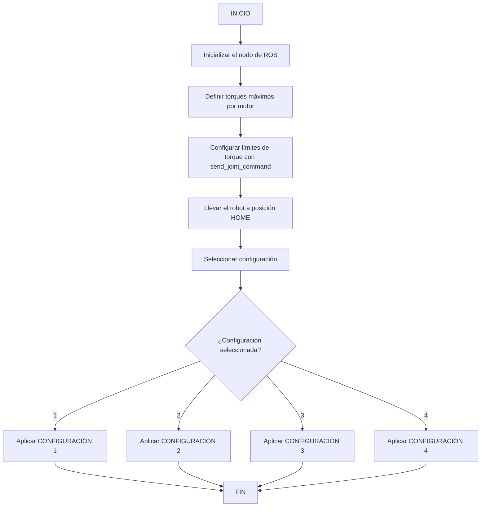

# Laboratorio 4 - Cinemática Directa con ROS 2
## PhantomX Pincher X100 | Mecatrónica UNAL 2025-I

### Integrantes del Grupo


| Andrés Mauricio Avilán |
| Juan David Meza |
| Hector Andres.. |
| Juan Manuel .. |

---

## Modelado Cinemático

El modelado matemático del manipulador incluye:

- Diagrama robot`


- Tabla de parámetros DH estándar (Denavit–Hartenberg)

---

## Descripción de la Solución Planteada

El script `macarena.py` desarrollado para controlar el manipulador PhantomX Pincher X100 está basado en ROS 2 y hace uso de los servicios de Dynamixel para controlar las articulaciones del brazo.

---

## Diagrama de Flujo del script macarena.py`



## Configuración ROS 2 - `macarena`

Este proyecto está desarrollado en **ROS 2 Humble**, y usa el paquete `dynamixel_sdk` para la comunicación con los motores del manipulador.
Para lanzar el sistema completo:

ros2 launch phanthon_control macarena.py


### 🔧 Configuración de Torque y Análisis de Límites de Movimiento

Antes de realizar cualquier tipo de movimiento con el manipulador, fue necesario identificar tanto los **valores máximos de torque permitidos para cada motor** como los **límites físicos de movimiento** de cada articulación expresados en **pulsos y grados**.

#### Torques máximos permitidos por motor

Estos valores fueron ajustados empíricamente para asegurar un movimiento suave y seguro, evitando vibraciones y pérdida de fuerza en posiciones extremas:

```python
torques = [500, 400, 350, 350, 350]  # [waist, shoulder, elbow, wrist, gripper]
```

---

### Análisis de límites de pulsos y conversión a grados

Para tener control preciso sobre las articulaciones, se midieron los límites de pulsos y su correspondencia con ángulos reales, permitiendo definir rangos válidos y realizar conversiones confiables entre grados y pulsos. Este análisis fue clave para programar movimientos seguros, sin sobrepasar los límites físicos del robot.

| Articulación  | Pulsos mínimo-máximo | Rango Angular estimado | Pulsos para 90° |
|---------------|----------------------|-------------------------|------------------|
| **x1 (cadera)**   | 0 – 657               | ~0° – 205°               | 290              |
| **x2 (hombro)**   | 220 – 804             | ~0° – 180°               | 290              |
| **x3 (codo)**     | 80 – 944              | ~-45° – 225°             | 290              |
| **x4 (muñeca)**   | 200 – 824             | ~0° – 180°               | 312              |
| **x5 (gripper)**  | 0 – 512               | ~4 mm – 38 mm (apertura) | —                |

> Con esta tabla, fue posible establecer funciones de conversión entre grados ↔ pulsos para programar los movimientos con precisión, evitando zonas peligrosas de saturación o colisión entre eslabones.

---

### Función de Envío de Comandos

Se definió una función central llamada `macarena` para encapsular la lógica de comunicación con los motores Dynamixel:

```python

aqui todo codigo python

```

**Parámetros:**

- `comando`: Descripcion.
- `comando`: Descripcion.
- `comando`: Descripcion.

Esta función se usa para configurar torques, mover motores a HOME y moverlos a poses específicas.

---

### Video de ejecución secuencial

El video de la rutina completa del manipulador ejecutando las poses


---

### Comparación de poses digitales vs reales

A continuación se muestra una tabla con las comparaciones entre la simulación digital y la fotografía real del manipulador:


---

## Conclusiones


